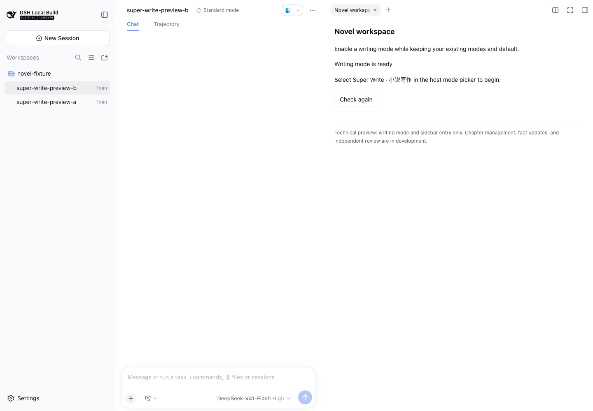

# dsh-super-novel

DeepSeek Harness 的小说写作插件，提供小说生成预设和右侧「小说生成工作台」。

## 介绍

在聊天中规划故事、起草章节、续写或润色。预设会提醒模型关注人物动机、情节连续性、作者文风和修改范围；模型、权限和工具沿用 Harness 的配置。

当前 `0.0.2` 是技术预览：已提供写作提示词、预设启用和状态侧栏。章节管理、作品存储、自动事实回填、独立审校和修订工具尚未实现。

## 安装

需要 DeepSeek Harness `0.1.5-rc.2`，Node.js `^22.19.0 || >=24.0.0`。其他宿主版本尚未验证。

取得本地安装包后，在目标 profile 中安装（将路径替换为实际绝对路径）：

```sh
dsh plugin --profile web add /absolute/path/dsh-super-novel-0.0.2.tgz
```

从源码生成安装包见[开发说明](docs/development.md)。市场收录与 npm 发布是独立流程，本说明不代表当前版本已上架。

## 使用

1. 打开会话，在右侧栏开始页选择「小说生成工作台」。
2. 点击「启用小说生成模式」。
3. 在宿主模式选择器中选择 **Super Novel · 小说生成**。列表未更新时，关闭后重新打开。
4. 在聊天中提出写作要求，例如：

   > 写一段雨夜渡河的开场，用第三人称限知视角。主角左腕受伤，不能游泳；结尾停在船离岸时。

正文显示在宿主聊天中。当前侧栏只负责启用和状态显示，插件不保存作品文件。

[](docs/screenshots/p0-en-light.png)

截图来自早期 P0 的真实 Harness Web 验证，展示启用侧栏。界面支持中英文。

## 效果

目前完成了小规模真实模型对照和浏览器写作测试，尚不能证明写作质量提升。

| 测试 | 结果 |
| --- | --- |
| 3 个样本、6 次模型任务 | 均完成；文本仍有因果说服力问题 |
| 浏览器起草 | 要求 900–1200 字、6 段，实际 759 个汉字、13 段，未达标 |
| 指定段落修订 | 仅目标段落变化，其余 12 段逐字保留 |

写作质量优先，token 和耗时用于记录成本，不设必须下降的门槛。详见[评测说明](docs/evaluation.md)。

## 文档

- [文档目录](docs/README.md)
- [使用、升级与卸载](docs/usage.md)
- [开发与检查](docs/development.md)
- [当前架构](docs/architecture.md)

许可证：[Apache-2.0](LICENSE)。代码仓库：[ArtlexYoung/dsh-super-novel](https://github.com/ArtlexYoung/dsh-super-novel)。
