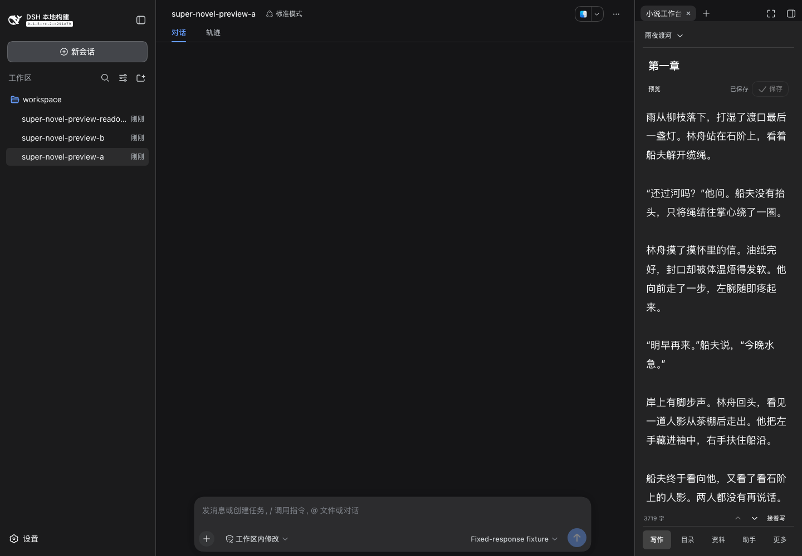
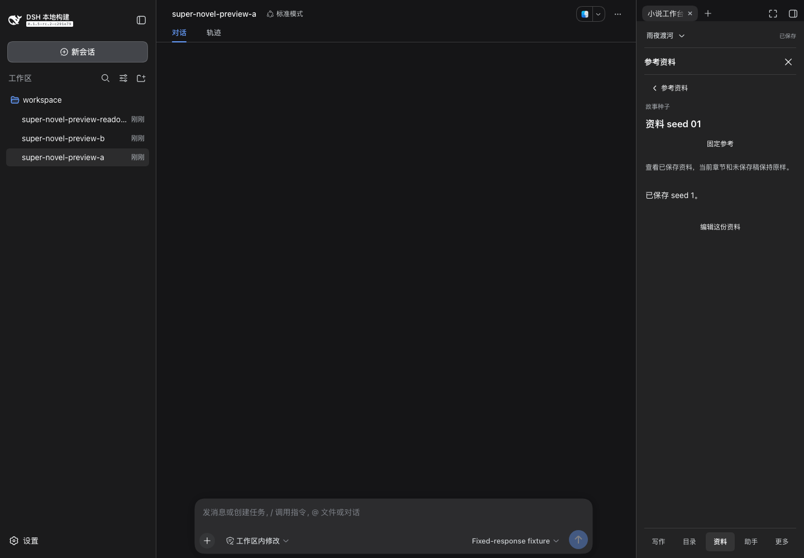
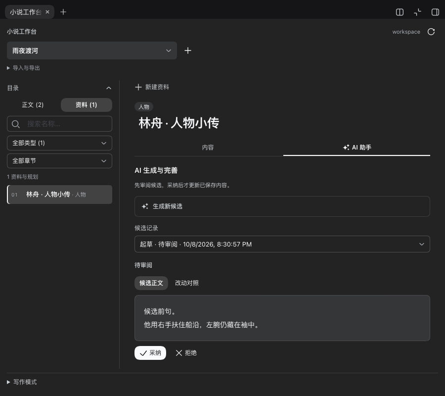

# dsh-super-novel

DeepSeek Harness 的小说写作插件，提供本地作品、章节编辑和右侧「小说工作台」。

## 介绍

在聊天中规划故事、起草章节、续写或润色。预设会提醒模型关注人物动机、情节连续性、作者文风和修改范围；模型、权限和工具沿用 Harness 的配置。

当前 `0.2.3` 是本地写作流程测试版，支持作品、章节、故事资料、文风授权、导入导出、起草、续写、选段改写和润色。生成结果单独保存为候选；作者查看改动并采纳后，才更新正式正文或资料。保存检查版本和正文哈希，发生外部冲突时保留原稿。

工作台沿用 DSH 的组件和主题。窄侧栏以正文为主，底部提供「写作、目录、资料、助手、更多」。目录和工具一次展开一个，关闭后回到原光标和滚动位置。资料先只读查看，点击「编辑这份资料」才切换文档；保存位置、导入导出和历史放在「更多」。支持 ⌘/Ctrl+S，草稿与正式保存状态始终可见。

候选可以拒绝或停止，换会话、关闭侧栏和重启后可查看记录。未完成、截断或过期的候选不能采纳。可以查看正文历史、恢复旧稿，或保留本地与磁盘两份稿后手动合并。保存正文后可提取带引用的事实和摘要候选，作者采纳后用于下一章。独立审校提供字数、段数和占位内容检查，定位问题后可生成最多两轮局部修订候选，再复核和采纳；依据不足时不会显示通过。

## 安装

支持 DeepSeek Harness `^0.1.5-rc.2 || ^0.2.0-rc.2`，需要 Node.js `^22.19.0 || >=24.0.0`。新版预设、通信校验和图标接口已适配，保留旧版支持。

| 已实测宿主 | 环境与结果 |
| --- | --- |
| `0.1.5-rc.2` | macOS Web：完整写作流程与重启恢复通过 |
| `0.2.0-rc.2` | macOS DSH NEXT `2.0.17-next` 安装版：侧栏、完整写作流程与重启恢复通过 |

其他符合范围的版本尚未逐个运行。Safari 已补验保存、手工事件和伏笔计划；完整验收和 Windows/Linux 实机检查仍待完成，范围见[评测说明](docs/evaluation.md)。

取得本地安装包后，在目标 profile 中安装（将路径替换为实际绝对路径）：

```sh
dsh plugin --profile web add /absolute/path/dsh-super-novel-0.2.3.tgz
```

DSH NEXT 可从「插件」→「添加插件」填入安装包的绝对路径。安装到实际使用的 profile，完成后按宿主提示重新加载。从源码生成安装包见[开发说明](docs/development.md)。市场收录与 npm 发布是独立流程，本说明不代表当前版本已上架。

安装异常时，在实际 profile 目录运行 `node node_modules/dsh-super-novel/scripts/doctor.mjs`，检查 Node、构建文件和依赖版本；该命令只读，不调用模型。

## 使用

1. 打开带本地 workspace 的会话，在右侧栏选择「小说工作台」。
2. 点击顶部作品名或底部「更多」新建、切换作品。在「目录」中新建章节，回到「写作」编辑并保存。只读会话不能写入。
3. 点击底部「助手」，选择任务、填写要求并生成。改写、润色前先在正文中选中文字。
4. 查看候选和改动对照，点击采纳或拒绝。例如写作要求：

   > 写一段雨夜渡河的开场，用第三人称限知视角。主角左腕受伤，不能游泳；结尾停在船离岸时。

在「目录」切到「资料」，点击「新建资料」，选故事种子、书卡、人物、世界、总纲、章纲或场景，写想法后点击「AI 生成资料」。名称可留空，也可勾选已有资料或保存正文作为来源；章纲、场景可关联章节。生成后进入「AI 助手」审阅候选，采纳后回到「写作」查看和编辑，再供章节写作引用。不强制填完整规划，也不自动把新设定当成正文事实。

底部「资料」用于查看参考；类型和名称筛选只影响列表，不切走正在写的章节。「更多」提供「事实与文风」「审校」、草稿恢复和历史。可预览 Markdown/TXT 分章后导入新作品，按正文或资料导出并回读。作者可授权选中正文作为叙述或人物对白样本，生成时主动选用；授权可撤销，来源变化后停止使用。

生成使用当前会话所选模型，不读取其他作品或聊天历史。请先保存手工改动；参考资料由作者主动填写或勾选。聊天写作可在宿主选择 **Super Novel · 小说生成**；`0.1` 宿主须先展开「写作模式」启用，`0.2` 宿主随插件注册。不会改变默认模式，聊天回复仍需手工保存。

输入先保留在浏览器，再自动写入磁盘草稿。看到「草稿已存到磁盘」才表示检查点落盘；正式正文仍需点击保存。清除浏览器数据或重启后，可在「更多」→「恢复草稿」预览并恢复。

在「更多」展开「保存位置」可修改作品根目录、切回之前的位置或一键打开目录。切换保留原库，不移动、不删除作品；工作区写入模式只能选择当前工作目录内的位置。目录位于 DSH 宿主，远程 Web 不会打开浏览器所在电脑的同名目录。

[](docs/screenshots/writing-sidebar-zh-dark.png)

截图来自 `0.2.1` 实际安装包，使用合成稿件。300px 侧栏只保留作品名、章节名、保存条、正文和底部入口。

[](docs/screenshots/writing-references-zh-dark.png)

查资料不会替换当前正文，也不会调用模型；宽面板保留左侧目录。

## 效果

[](docs/screenshots/material-generation-zh-dark.png)

资料入口截图来自 `0.1.4` 实际安装包；展示的是合成测试作品，界面流程使用固定响应验证。

目前完成了小规模真实模型对照、浏览器写作、`0.1.1` 真实模型技术补验和 `0.1.2` 人物资料整理补验，尚不能证明写作质量提升。资料整理通路完成，但仍需核对知情范围；首章段数约束、模型审校和修订质量有失败。详见[评测说明](docs/evaluation.md)。

| 测试 | 结果 |
| --- | --- |
| 3 个样本、6 次模型任务 | 均完成；文本仍有因果说服力问题 |
| 浏览器起草 | 要求 900–1200 字、6 段，实际 759 个汉字、13 段，未达标 |
| 指定段落修订 | 仅目标段落变化，其余 12 段逐字保留 |

上表为历史结果，不是当前版本的重新评测。

写作质量优先，token 和耗时用于记录成本，不设必须下降的门槛。详见[评测说明](docs/evaluation.md)。

## 文档

- [文档目录](docs/README.md)
- [使用、升级与卸载](docs/usage.md)
- [开发与检查](docs/development.md)
- [当前架构](docs/architecture.md)

许可证：[Apache-2.0](LICENSE)。代码仓库：[ArtlexYoung/dsh-super-novel](https://github.com/ArtlexYoung/dsh-super-novel)。

整书备份：在「更多 → 整书备份与恢复」中备份、核验和恢复。备份包含正文、资料、磁盘草稿、候选与历史，写作期间每 15 分钟尝试备份，目录可修改和打开。恢复生成新目录，原作品保留；跨库记录保留来源身份。备份使用可独立解包的 tar.gz，不上传作品，默认不清理副本。

资料库：在「资料 → 新建与管理资料」或「更多 → 资料库」中全文搜索、贴标签、收藏、关联多个章节和资料。归档与回收站保留内容和历史，可恢复。启用新版资料库前自动完整备份；旧插件不能编辑新版作品格式。正文选区可保存为带来源版本的资料；AI 整理先生成候选。

写作时可固定参考、找最近看过的资料，切前后章，或从选区打开 AI。字体、行距和阅读宽度在「更多 → 写作外观」调整。参考与工具关闭后返回原光标和滚动位置。

本章意图可选填写，也可让 AI 给出方向后编辑。生成前能预览本次上下文、来源和大小；硬约束完整保留。审校可只检查选区，修订先作为候选，范围外文字由程序保持原样。

在「更多 → 时间线、人物状态与伏笔」中，用已保存正文选区记录事件、位置、伤势、物品和知情变化。AI 可一次整理本章建议，逐项核对后才保存。伏笔区分计划、已出现、待回收和已回收，回收须保留两处正文引用。修改旧章后可查看受影响记录；不自动改人物卡，相关候选过期，无关章节编辑可继续写作。
