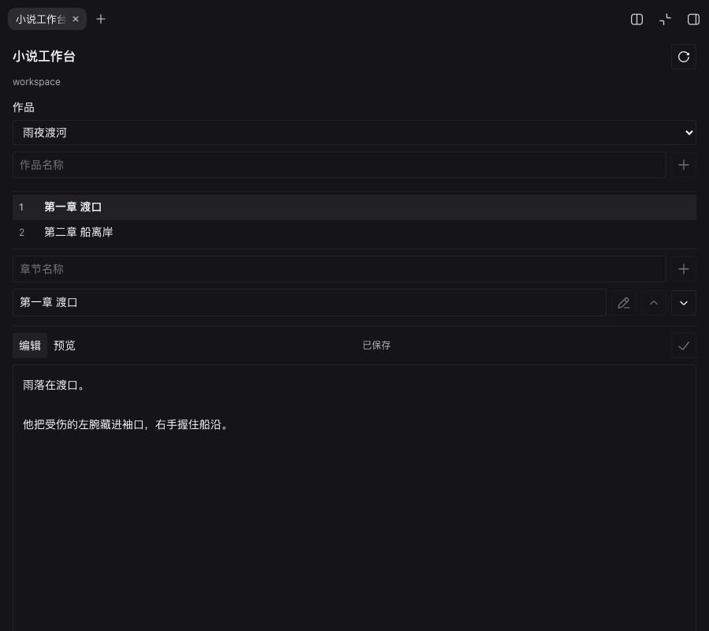
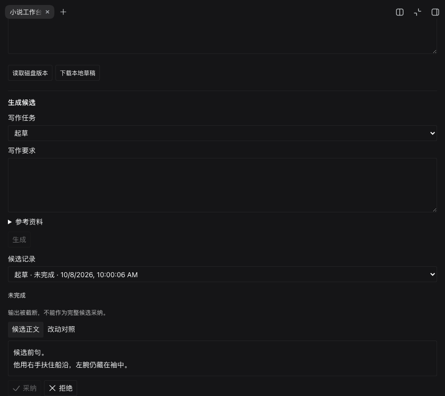

# dsh-super-novel

DeepSeek Harness 的小说写作插件，提供本地作品、章节编辑和右侧「小说工作台」。

## 介绍

在聊天中规划故事、起草章节、续写或润色。预设会提醒模型关注人物动机、情节连续性、作者文风和修改范围；模型、权限和工具沿用 Harness 的配置。

当前 `0.0.6` 支持本地作品、章节、故事资料与规划，以及起草、续写、选段改写和润色。生成结果单独保存为候选；作者查看改动并采纳后，才更新正式正文或资料。保存会检查版本和正文哈希，外部修改发生冲突时保留原稿。

候选可以拒绝或停止，换会话、关闭侧栏和重启后可查看记录。未完成、截断或过期的候选不能采纳。可以查看正文历史、恢复旧稿，或保留本地与磁盘两份稿后手动合并。自动事实回填和独立审校尚未实现。

## 安装

需要 DeepSeek Harness `0.1.5-rc.2`，Node.js `^22.19.0 || >=24.0.0`。其他宿主版本尚未验证。

取得本地安装包后，在目标 profile 中安装（将路径替换为实际绝对路径）：

```sh
dsh plugin --profile web add /absolute/path/dsh-super-novel-0.0.6.tgz
```

从源码生成安装包见[开发说明](docs/development.md)。市场收录与 npm 发布是独立流程，本说明不代表当前版本已上架。

## 使用

1. 打开带本地 workspace 的会话，在右侧栏选择「小说工作台」。
2. 新建作品和章节，编辑正文，点击保存。只读会话不能写入。
3. 在「生成候选」选择任务，填写写作要求并生成。改写、润色前先在正文中选中文字。
4. 查看候选和改动对照，点击采纳或拒绝。例如写作要求：

   > 写一段雨夜渡河的开场，用第三人称限知视角。主角左腕受伤，不能游泳；结尾停在船离岸时。

在「资料与规划」编辑故事种子、书卡、人物、世界、总纲、章纲或场景。章纲、场景可关联正文；生成前可勾选已保存资料，不强制填完整规划。

生成使用当前会话所选模型，不读取其他作品或聊天历史。请先保存手工改动；参考资料由作者主动填写或勾选。需要聊天写作时，可以展开「写作模式」启用 **Super Novel · 小说生成**，聊天回复仍需手工保存。

未保存输入会尽量保留在浏览器本地；清除浏览器数据会丢失这部分草稿，正式保存的正文不受影响。

[](docs/screenshots/books-zh-dark.png)

章节截图来自 `0.0.3` 安装包的真实 Harness Web 验证。界面支持中英文、明暗主题和全屏。

[](docs/screenshots/proposals-zh-dark.png)

候选截图来自 `0.0.4` 实际安装包，使用固定响应验证流程。图中截断的候选保留供查看，采纳按钮不可用。

## 效果

目前完成了小规模真实模型对照和浏览器写作测试，尚不能证明写作质量提升。

| 测试 | 结果 |
| --- | --- |
| 3 个样本、6 次模型任务 | 均完成；文本仍有因果说服力问题 |
| 浏览器起草 | 要求 900–1200 字、6 段，实际 759 个汉字、13 段，未达标 |
| 指定段落修订 | 仅目标段落变化，其余 12 段逐字保留 |

写作质量优先，token 和耗时用于记录成本，不设必须下降的门槛。详见[评测说明](docs/evaluation.md)。

## 文档

- [文档目录](docs/README.md)
- [使用、升级与卸载](docs/usage.md)
- [开发与检查](docs/development.md)
- [当前架构](docs/architecture.md)

许可证：[Apache-2.0](LICENSE)。代码仓库：[ArtlexYoung/dsh-super-novel](https://github.com/ArtlexYoung/dsh-super-novel)。
